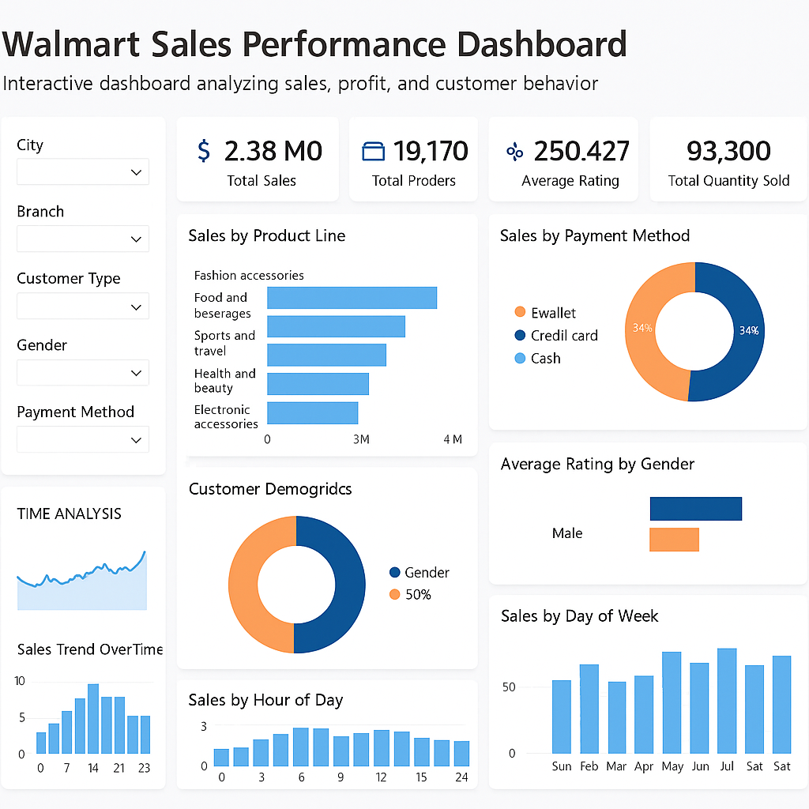

# 🛒 Walmart Sales Analysis

---

### 📌 **Concise Summary of the Data Analysis Workflow (Walmart Sales Dashboard)**

1. 📥 **Data Collection**

   * Gathered Walmart transactional data including sales, customer details, product categories, and ratings.

2. 🧹 **Data Cleaning**

   * Removed duplicates, handled missing values, corrected data types, and standardized fields (e.g., gender, payment methods).

3. 🔄 **Data Transformation**

   * Aggregated sales, orders, and quantities by product line, customer type, time, and branch for analysis.

4. 📈 **Exploratory Data Analysis (EDA)**

   * Visualized trends in product sales, payment modes, customer demographics, and temporal sales patterns.

5. 🧠 **Insight Extraction**

   * Identified top-performing products, peak purchase hours, popular payment methods, and balanced gender participation.

6. 🖥️ **Dashboard Creation**

   * Built an interactive dashboard using filters for city, branch, gender, and payment method to allow dynamic insights.

7. 📝 **Reporting & Recommendations**

   * Summarized key insights into strategic recommendations for business decision-making.

---

### 🛠️ **Tools Used**

* 📊 **Excel** – For preliminary data cleaning and quick analysis
* 🛢️ **SQL** – To query and manipulate structured datasets
* 🐍 **Python** – For advanced data wrangling and exploratory analysis
* 📊 **Power BI** – To create an interactive, user-friendly dashboard

---

## **Walmart Sales Performance Dashboard Summary**

### 🗝️ **Key Findings:**

* 📊 **Total Sales** reached **\$2.38M**, with **93,300 units sold** and **19,170 total orders**.
* 👜 **Fashion Accessories** led product sales, followed by **Food & Beverages**.
* 💳 **Sales are evenly split by payment methods**: E-wallet, Credit Card, and Cash (each around 34%).
* 🚻 **Customer gender distribution is equal** (50% male, 50% female).
* ⭐ **Average product rating** is **250.427**, with males generally giving higher ratings.
* ⏰ **Sales peak between 10 AM and 3 PM**, with a dip late at night.
* 📅 **Highest weekly sales** observed in **July** and **Saturdays**.

---

### 📂 **Supporting Data:**

* 🛍️ **Product Line Sales**:

  * 👜 Fashion Accessories: \~4M
  * 🍔 Food & Beverages: \~3M
  * 🏕️ Sports & Travel: \~2.5M
* ⭐ **Customer Ratings**:

  * 👨 Males rated higher than females.
* 📈 **Sales Trends**:

  * 📆 Weekly sales peak in **May, July, and September**.
  * ⏲️ Sales by hour highest from **10 AM to 3 PM**.

---

### 💡 **Recommendations:**

* 📦 **Stock more Fashion Accessories** due to high demand.
* 👷 **Optimize staffing and promotions between 10 AM - 3 PM**.
* 📣 **Target Saturday campaigns** with special offers.
* 🧠 **Use gender-based insights** for personalized marketing.
* 🧾 **Continue supporting all three payment methods** to retain customer satisfaction.

---

### 📊 **Report & Insight:**

* ⚖️ Balanced performance across demographics and payment preferences.
* 🌟 Fashion Accessories outperformed other product lines.
* 🕒 Customer behavior shows strong time- and day-based purchase patterns.
* 👩‍💼 Gender participation is equal, offering potential for segmented targeting.

---

### 🧾 **Conclusions:**

* ✅ Walmart shows strong, well-rounded performance across key metrics.
* 🎯 Strategic planning around time slots and product types can increase ROI.
* 🤝 Equal gender and payment preference usage reflect broad customer appeal.